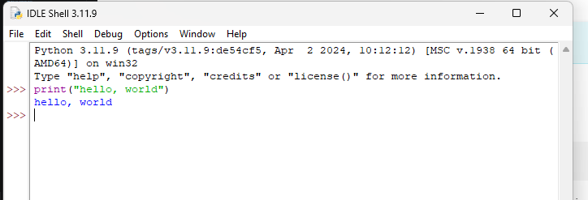

# Hoofdstuk 2 – Python Gebruiken

Zoals uitgelegd in de introductie: om te leren programmeren met dit boek, moet je Python kunnen schrijven en uitvoeren. Dit hoofdstuk legt uit hoe je Python aan het werk krijgt.

---

## 2.1 Python installeren

Om Python te gebruiken heb je een **Python interpreter** nodig. Die is gratis verkrijgbaar voor vrijwel alle computers.

!!! info "Python downloaden"
    Ga naar [python.org](https://www.python.org){:target="_blank"} en download een **Python 3** interpreter voor jouw besturingssysteem. Installeer het programma door het gedownloade bestand te openen.

    ✅ Windows &nbsp;&nbsp; ✅ macOS &nbsp;&nbsp; ✅ Linux

Het maakt niet uit welk besturingssysteem je gebruikt — je schrijft overal dezelfde Python code. Je kunt een programma dat je op Windows schreef, kopiëren naar een Mac, en het zal (bijna altijd) gewoon werken.

!!! question "Wat met online Python systemen?"
    Er bestaan online omgevingen waar je Python kunt draaien zonder installatie. Dat kan, maar er zijn nadelen:

    - Gratis versies zijn vaak beperkt
    - Betaalde versies kosten geld en hebben eigenaardigheden
    - Uiteindelijk moet je Python toch lokaal installeren

    **Aanbeveling:** Installeer Python meteen lokaal op je computer.

---

## 2.2 Python programma's creëren

Python programma's zijn gewone **tekstbestanden** met de extensie `.py`.

### IDLE — de ingebouwde editor

De meeste Python installaties (zeker op Windows en macOS) installeren ook **IDLE** — een eenvoudige maar prima editor om in te programmeren.

Als je IDLE start, zie je de **Python shell**:

```python
>>> print(7/4)
1.75
>>> 7/4
1.75
```

De shell voert elke regel code onmiddellijk uit als je op ++enter++ drukt. Dit is handig om snel iets te testen, maar het is **niet** hoe je programma's schrijft.

!!! tip "Programmabestanden maken in IDLE"
    Ga naar **File → New File** om een nieuw programmabestand te openen. Schrijf je code, sla op met de extensie `.py`, en voer het uit via **Run → Run Module** (of druk op ++f5++).

    De uitvoer verschijnt in de Python shell.

### Andere editors

IDLE is kaal maar functioneel. Er zijn meer gebruiksvriendelijke alternatieven:

| Editor      | Geschikt voor | Gratis?       |
| ----------- | ------------- | ------------- |
| **IDLE**    | Beginners     | ✅             |
| **VS Code** | Gevorderd     | ✅             |
| **PyCharm** | Professioneel | ✅ (community) |
| **Thonny**  | Beginners     | ✅             |

!!! note "Teksteditor ≠ tekstverwerker"
    Een teksteditor (zoals IDLE) is **niet** hetzelfde als een tekstverwerker (zoals Word). Een teksteditor heeft geen opmaakopties, maar toont wel **syntax highlighting** — gekleurde woorden die aangeven wat elk stukje code betekent.

---

## 2.3 Python programma's uitvoeren

Wanneer je een `.py` bestand hebt opgeslagen, kun je het proberen te starten door erop te dubbelklikken. Dat werkt vaak **niet** zoals verwacht.

!!! warning "Waarom zie ik niks?"
    Python programma's worden uitgevoerd in een **command-line shell** van het besturingssysteem. Wat er gebeurt:

    1. Python opent de shell
    2. Het programma wordt uitgevoerd
    3. De shell sluit meteen weer

    Resultaat: een flits van een zwart venster, en dan niks meer.

**Oplossing:** Voer je programma's uit vanuit je editor (bijv. via ++f5++ in IDLE). Daar zie je de uitvoer gewoon in de Python shell verschijnen.

---

## 2.4 Aanvullend materiaal

Naast deze site heb je soms een referentie nodig. De officiële Python documentatie vind je op [docs.python.org](https://docs.python.org).

!!! tip "Zoektip"
    Zoek op internet: `python` + een korte omschrijving van wat je wilt. Je vindt zo snel de juiste documentatiepagina.

!!! danger "Pas op met oplossingswebsites"
    Er zijn sites die kant-en-klare code aanbieden voor veelvoorkomende problemen. Die zijn handig in de praktijk, maar **je leert er weinig van**. Vermijd ze zolang je aan het leren bent.

Wil je een extra info? Allen B. Downey's **Think Python** is een uitstekende aanvulling en gratis beschikbaar via [greenteapress.com](https://greenteapress.com/wp/).

---

## Opgaven

### Opgave 2.1 — Hello, world!

!!! example "Opgave 2.1"
    Download Python en installeer het op je computer. Start IDLE.

    Maak een bestand `hello.py` met de volgende code:

    ```python
    print("Hello, world!")
    ```

    Voer het programma uit en controleer of de tekst `Hello, world!` verschijnt in de IDLE shell.
    
### Opgave 2.2 — De Python shell verkennen

!!! example "Opgave 2.2"
    Open de IDLE shell en typ het volgende commando:

    ```python
    print(7/4)
    ```

    Daarna:

    ```python
    7/4
    ```

    In beide gevallen zie je `1.75`. Maar de reden verschilt:

    - Bij `print(7/4)`: de `print()` functie toont de uitkomst van `7/4`
    - Bij `7/4` zonder print: de shell toont automatisch de uitkomst van elke expressie

    **Opdracht:** Schrijf een Python programma (dus een `.py` bestand) dat alleen de regel `7/4` bevat — zonder `print`. Voorspel eerst wat er gebeurt als je het uitvoert:

    - Toont de shell `1.75`?
    - Toont de shell niks?
    - Krijg je een foutmelding?

    Voer het programma uit en controleer of je voorspelling klopte.

??? note "Verklaring"
    De shell toont automatisch uitkomsten als je interactief typt. Maar in een programmabestand gebeurt dat **niet** — je moet `print()` gebruiken om iets op het scherm te krijgen.

---

*Volgende: [Hoofdstuk 3 – Expressies](h03-expressies.md)*
